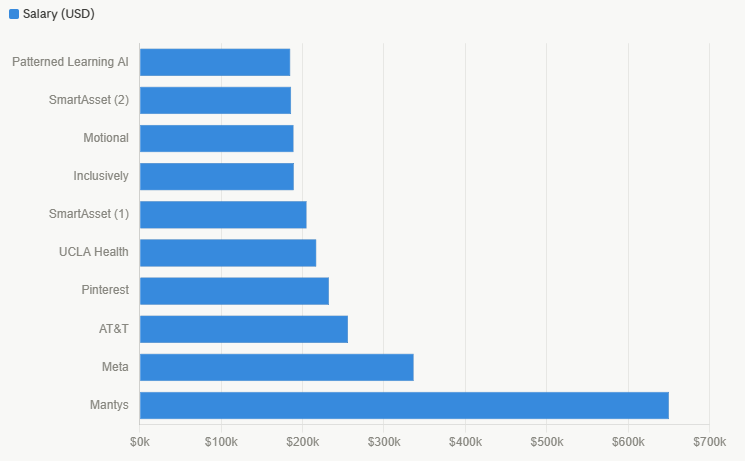
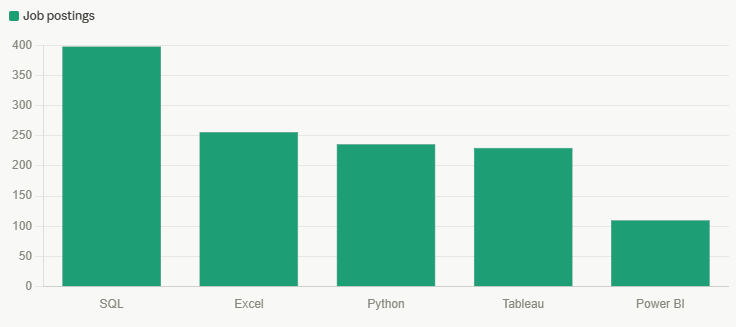
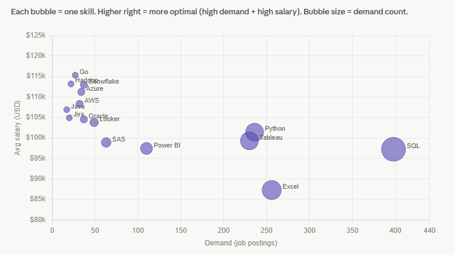

# Data Analyst Job Market Analysis
A SQL-based analysis of the data analyst job market, focusing on remote roles. This project explores top-paying jobs, in-demand skills, and the most optimal skills to learn for maximizing both employability and salary.

## Tools Used
- **SQL** (PostgreSQL)
- **VS Code**
- **Git & GitHub**

---

## The Analysis

### 1. Top Paying Data Analyst Jobs
Identifies the top 10 highest-paying remote Data Analyst roles with specified salaries.

[View Query](project_sql/1_top_paying_jobs.sql)

> Note: The $650,000 salary at Mantys is a significant outlier. Most top-paying roles are senior/director level positions ranging from $185,000–$336,500.

---

### 2. Skills for Top Paying Jobs
Using a CTE to find what skills are associated with the top 10 highest-paying remote Data Analyst roles.

[View Query](project_sql/2_top_paying_job_skills.sql)

**Results:** Based on the top 10 highest-paying job postings:
- SQL — 8 appearances
- Python — 7 appearances
- Tableau — 6 appearances
- Other notable skills: R, Snowflake, Pandas, Excel

---

### 3. Most In-Demand Skills
Finds the top 5 most frequently requested skills in remote Data Analyst job postings.

[View Query](project_sql/3_top_demanded_skills.sql)

---

### 4. Top Paying Skills
Finds the average salary associated with each skill for remote Data Analyst roles.

[View Query](project_sql/4_top_paying_skills.sql)

**Results:**
- **Big Data & ML** pays the most — PySpark, Pandas, NumPy, Jupyter
- **DevOps/Engineering crossover** boosts salary — GitLab, Kubernetes, Airflow
- **Cloud skills** are increasingly valuable — Databricks, Elasticsearch, GCP

---

### 5. Most Optimal Skills to Learn
Combines demand and salary data to identify skills that are both highly sought after and well compensated. Only includes skills with more than 10 job postings to ensure statistical relevance.

[View Query](project_sql/5_optimal_skills.sql)

> Note: Skills toward the top-right of the chart are most optimal — high demand and high salary. Python, Tableau, and SQL cluster as the sweet spot. Cloud skills like Snowflake and Azure sit higher on salary but lower on demand.

---

## Key Takeaways
- **SQL, Python, and Tableau** dominate both demand and top-paying job requirements
- **Big data and ML skills** (PySpark, Pandas) command the highest salaries
- **Cloud proficiency** (AWS, Azure, GCP) is increasingly valuable and well compensated
- For someone entering the field, **SQL + Python + Tableau** represents the highest ROI skill set
